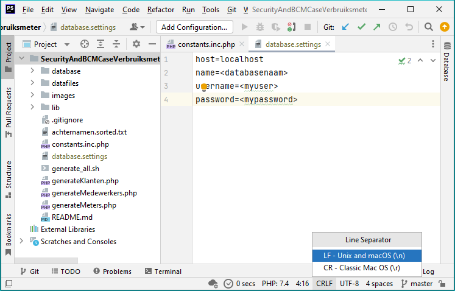

# Security & Risk : Case Verbruiksmeter
Supporting code for the case of the "Verbruiksmeter"

## Aanmaken database
Maak via MySQL eerst zelf een database aan met de naam `energy` of `nrg`. Open daarna het bestand `CreateDatabase.sql` uit
de map `database` en voer deze uit binnen deze nieuwe database.

Om een database aan te maken en te gebruiken moet je de juiste rechten hebben. Zie ook [MariaDB GRANT](https://mariadb.com/kb/en/grant/).  We gaan eerst controleren of
de juiste user ('website'@'%') wel de juiste rechten heeft. Dit is de user die je kunt gebruiken via PHPStorm. 

**LET OP** Een gebruiker op MySQL en MariaDB is een combinatie van een gebruikersnaam ('website') en een host waar vandaan je **inlogt** (en dus **niet** de host waar MySQL of MariaDB op draait!). 

We gebruiken het wildcard teken `'%'` om aan te geven dat je van alle hosts mag verbinden. Dit is meestal **NIET** verstandig in productie, maar wel *handig* voor de **development-fase**. Het probleem is namelijk dat je dan vanaf de buitenwereld toegang tot het DBMS (MySQL/MariaDB) openzet en dat is normaliter niet gewenst. Zorg er dus voor dat je dergelijke gebruikers weer opruimt voordat je je VM oplevert!

Je kunt ook gebruikmaken van `'localhost'` om aan te geven dat je alleen vanaf dezelfde machine als waar MariaDB/MySQL geinstalleerd staat mag verbinden. Dit is typisch de manier om je PHP-code aan de database te verbinden.

```bash
student@secbcm:~$ sudo mysql -u root
[sudo] password for student:
Welcome to the MariaDB monitor.  Commands end with ; or \g.
Your MariaDB connection id is 34
Server version: 10.5.12-MariaDB-0+deb11u1 Debian 11

Copyright (c) 2000, 2018, Oracle, MariaDB Corporation Ab and others.

Type 'help;' or '\h' for help. Type '\c' to clear the current input statement.

MariaDB [(none)]> use mysql;
Reading table information for completion of table and column names
You can turn off this feature to get a quicker startup with -A

Database changed
MariaDB [mysql]> select user,host from user;
+-------------+-----------+
| User        | Host      |
+-------------+-----------+
| website     | %         |
| mariadb.sys | localhost |
| mysql       | localhost |
| root        | localhost |
| website     | localhost |
+-------------+-----------+
5 rows in set (0.001 sec)

MariaDB [mysql]> SHOW GRANTS FOR 'website'@'%';
+--------------------------------------------------------------------------------------------------------+
| Grants for website@%                                                                                   |
+--------------------------------------------------------------------------------------------------------+
| GRANT USAGE ON *.* TO `website`@`%` IDENTIFIED BY PASSWORD '*0CD1AE57344BB752E3A08B733916948E5A4BF96C' |
| GRANT ALL PRIVILEGES ON `nrg`.* TO `website`@`%`                                                       |
| GRANT ALL PRIVILEGES ON `energy`.* TO `website`@`%`                                                    |
+--------------------------------------------------------------------------------------------------------+
3 rows in set (0.000 sec)

```

We zien nu dat de user 'website'@'%' het recht 'USAGE' heeft voor MariaDB. Daarnaast heeft deze user alle rechten ('ALL PRIVILIGES') voor twee databases: 'nrg' en 'energy'. 

**LET OP** Als je dus een andere databasenaam gebruikt, zul je zelf een `GRANT` statement moeten uitvoeren om de juiste rechten te zetten.

**LET OP** Als je nog geen gebruiker hebt dan moet je zelf een nieuwe gebruiker aanmaken. Instructies vindt je op de [MariaDB Website](https://mariadb.com/kb/en/create-user/). Gebruik de variant waarbij je een "Authentication Plugin" gebruikt van het type ["mysql_native_password"](https://mariadb.com/kb/en/authentication-plugin-mysql_native_password/). Zie ook [hier](https://mariadb.com/kb/en/create-user/#identified-viawith-authentication_plugin). 

## Database instellingen opnemen
Maak in de root van deze map met PHP-bestanden een nieuw bestand genaamd `database.settings`.
Zet daar onderstaande regels in en vul de juiste waarden in:
```ini
host=localhost
name=<databasenaam>
username=<myuser>
password=<mypassword>
```

**LET OP** Als je gegevens kopieert en plakt van Windows naar Linux kun je last krijgen met het probleem van regelovergangen. Zie ook [hier](https://www.aleksandrhovhannisyan.com/blog/crlf-vs-lf-normalizing-line-endings-in-git/#crlf-vs-lf-what-are-line-endings-anyway).

Mocht je dus bovenstaande tekst kopieren en plakken in software die voor Windows gemaakt is heb je kans dat er achter elke regel een onzichtbaar teken staat (de `CR`). 
Je krijgt dat bijvoorbeeld een foutmelding (`php_network_getaddresses: getaddrinfo failed: Name or service not known in`) dat de host niet gevonden kan worden, 
terwijl er wel gewoon `localhost` lijkt te staan. 

```PHP
[host] = localhost
[name] = <databasenaam>
[username] = <myuser>
[password] = <mypassword>
HOST=localhost
DBNAME=<databasenaam>
USER=<myuser>
PASSWORD=<mypassword>
PHP Fatal error:  Uncaught PDOException: PDO::__construct(): php_network_getaddresses: getaddrinfo failed: Name or service not known in /home/student/SecurityAndBCMCaseVerbruiksmeter/generateMedewerkers.php:24
Stack trace:
#0 /home/student/SecurityAndBCMCaseVerbruiksmeter/generateMedewerkers.php(24): PDO->__construct()
#1 {main}

Next PDOException: SQLSTATE[HY000] [2002] php_network_getaddresses: getaddrinfo failed: Name or service not known in /home/student/SecurityAndBCMCaseVerbruiksmeter/generateMedewerkers.php:24
Stack trace:
#0 /home/student/SecurityAndBCMCaseVerbruiksmeter/generateMedewerkers.php(24): PDO->__construct()
#1 {main}
  thrown in /home/student/SecurityAndBCMCaseVerbruiksmeter/generateMedewerkers.php on line 24
student@secbcm:~/SecurityAndBCMCaseVerbruiksmeter$
```
Eenvoudigste oplossing is door in een teksteditor (bijv. PHPStorm of Notepad++) rechtsonderin te checken.





## Instellen aantallen te genereren items
In het bestand `generateMeters.php` vind je bovenin een aantal instellingen:
```php
define("METERSTANDEN_DATE_START", "2016-01-01");

define("NR_OF_CITIES", 10);

define("MIN_STREETS_PER_CITY", 30);
define("MAX_STREETS_PER_CITY", 75);

define("MIN_HUISNUMMERS_PER_STRAAT", 10);
define("MAX_HUISNUMMERS_PER_STRAAT", 40);

// het gemiddelde jaarverbruik voor GAS en ELECTRA (bandbreedte MIN-MAX)
define("AVERAGE_USAGE_YEAR_E_MIN", 3500);
define("AVERAGE_USAGE_YEAR_E_MAX", 4500);
define("AVERAGE_USAGE_YEAR_G_MIN", 3000);
define("AVERAGE_USAGE_YEAR_G_MAX", 4500);
```
Hiermee kun je regelen hoe groot de set aan gegevens moet zijn.

## Aanmaken random adressen, meters, meterstanden & klanten
Open een terminal venster op de locatie van deze scripts en start onderstaande commando's

```bash
php generateMeters.php
php generateKlanten.php
```

Je ziet enige rapportage over de voortgang. Genereren van meterstanden en adressen:
```text  
Performing cleanup
.......
Telwerken.......
Meterstanden.......
Meters.......
Adressen.......
Found:  5630 places and 8606 streets
Using (0 of 50) Steenenkruis and ZIP-code 4162
 - Generating 11 streets
  - [0] Generating 15 home-addresses
  - [1] Generating 21 home-addresses
  - [2] Generating 17 home-addresses
  - [3] Generating 11 home-addresses
  - [4] Generating 28 home-addresses
  - [5] Generating 16 home-addresses
  - [6] Generating 11 home-addresses
  - [7] Generating 32 home-addresses
  - [8] Generating 15 home-addresses
  - [9] Generating 16 home-addresses
.....
```

```text  
Performing cleanup
.......
Klanten.......
Adres: 11900 
Adres: 11800 
Adres: 11700 
Adres: 11600 
Adres: 11500 
Adres: 11400 
Adres: 11300 
Adres: 11200 
Adres: 11100 
Adres: 11000 
Adres: 10900 
Adres: 10800 
Adres: 10700 
Adres: 10600 
...........
```

Uiteindelijk zullen er vele willekeurige gegevens in de database geplaatst worden.
Er worden grote hoeveelheden gegevens gegenereerd, dus enig geduld is wel nodig.
Af en toe kun je in je database management tool (bijv. PHPMyAdmin) kijken hoe het er voor staat. Een voorbeeld:


Dit is met 50 steden als NR_OF_CITIES.

Zie vervolgens in de map `database` het bestand  `example_queries.sql` voor enkele voorbeelden.
Het datamodel spreekt grofweg voor zichzelf:

1. Een adres heeft een uniek ID
1. Elke meter verwijst naar één adres via m_fk_idAdres
1. Een meter heeft één of meerdere telwerken
1. Een meter heeft één of meerdere meterstanden, steeds per telwerk.

Hieronder vind je het Entity Relation Diagram dat de tabellen en hun relaties beschrijft.


## Verbeteringen
Deze data is natuurlijk pas het begin voor je project. Je zult zelf vast de nodige verbeteringen nodig hebben
om de applicatie af te kunnen maken. 

